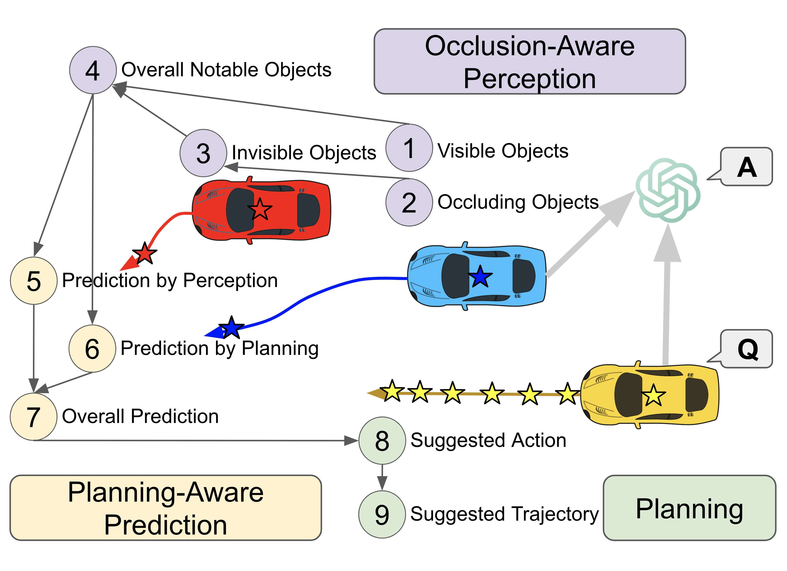

<div align="center">

# V2V-GoT: Vehicle-to-Vehicle Cooperative Autonomous Driving with Multimodal Large Language Models and Graph-of-Thoughts

Hsu-kuang Chiu<sup>1,2</sup>, Ryo Hachiuma<sup>1</sup>, Chien-Yi Wang<sup>1</sup>, Yu-Chiang Frank Wang<sup>1</sup>, Min-Hung Chen<sup>1*</sup>, Stephen F. Smith<sup>2*</sup>

<sup>1</sup>NVIDIA, <sup>2</sup>Carnegie Mellon University, <sup>*</sup> equally advising


[project](https://eddyhkchiu.github.io/v2vgot.github.io/)  [arxiv](https://arxiv.org/abs/2509.18053)



</div>

<b>V2V-GoT</b>: Graph-of-thoughts reasoning framework for vehicle-to-vehicle cooperative autonomous driving. All Connected Autonomous Vehicles (CAVs) share their perception features with the Multimodal Large Language Model (MLLM), as illustrated by the grey arrows. Any CAV can ask the MLLM to provide a suggested future trajectory or answer perception or prediction questions. The MLLM fuses the perception features from all CAVs and performs inference by following the graph-of-thoughts. If two QA nodes are connected by a directed edge in the graph, as illustrated by black arrows, the answer of the parent node QA is used as the input context of the child node QA.
  
## Overview
We propose the first graph-of-thoughts framework specifically designed for MLLM-based cooperative autonomous driving. Our graph-of-thoughts includes our proposed novel ideas of occlusion-aware perception and planning-aware prediction. We curate the <b>V2V-GoT-QA</b> dataset and develop the <b>V2V-GoT</b> model for training and testing the cooperative driving graph-of-thoughts. Our experimental results show that our method outperforms other baselines in cooperative perception, prediction, and planning tasks. For more details, please refer to our paper at <a href="https://arxiv.org/abs/2509.18053">arxiv</a>.

## Code
```shell
git clone git@github.com:eddyhkchiu/V2V-GoT.git
```

## Setup
We will create two conda env: 1. dmstrack and 2. llava.
The first conda env dmstrack is for training and inference QA generation, evaluation, and visualization. 
The second conda env llava is for model training and model inference.
Please follow steps 1 ~ 4 of [DMSTrack](https://github.com/eddyhkchiu/DMSTrack/blob/master/docs/SETUP.md) instructions to setup the dmstrack conda env.
Please follow [LLaVA 1.5](https://github.com/haotian-liu/LLaVA) instructions to setup the llava conda env.

## Dataset
Please download the three zip files from [TODO](https://TODO), save them to the V2V-GoT folder, and then unzip them.
The file dataset_processed_features_and_gt.zip has V2V4Real 3D object detection results, processed perception features, point clouds, and ground-truth data.
The file dataset_jsons.zip has V2V-GoT-QA and V2V-QA data.
The file model_ckpt.zip has model checkpoints of V2V-GoT and V2V-LLM that can reproduce the performance numbers in our paper.
After unzip, you should be able to see the following folders and files:
```
V2V-GoT
├── dataset_processed_features_and_gt.zip
├── dataset_jsons.zip
├── model_ckpt.zip
├── DMSTrack
│   ├── DMSTrack/
│   ├── V2V4Real/
│   │   ├── official_models/
│   │   │   ├── no_fusion_keep_all/
│   │   │   │   ├── npy/
│   │   │   │   │   ├── co_llm/
│   │   │   │   │   │   ├── v2v4real_3d_grounding_qa_dataset_v2vgot.json
│   │   │   │   │   ├── ego/
│   │   │   │   │   │   ├── 0000_gt.npy
│   │   │   ├── train_no_fusion_keep_all/
│   │   │   ├── early/
│   ├── AB3DMOT/
├── LLaVA
│   ├── checkpoints/
│   │   ├── llava-v1.5-7b-task-lora/
│   │   │   ├── llava-v1.5-7b-task-lora_v2v4real_3d_grounding_v2vgot_10ep_both_shallow_f2
│   │   │   │   ├── checkpoint-4330
```

## Inference
### V2V-GoT
To run the inference using our V2V-GoT model checkpoint and graph-of-thoughts, you can run the following script:
```
source LLaVA/scripts/v1_5/inference_v2vgot.sh  
```

The inference final and intermediate results of each QA node in our graph-of-thoughts will be saved at the following path:
```
V2V-GoT
├── LLaVA
│   ├── playground/
│   │   ├── data/
│   │   │   ├── eval
│   │   │   │   ├── v2vgot_10ep_both_shallow_f2_4330_full_nq1sm3w0dc
│   │   │   │   │   ├── answers
│   │   │   │   │   │   ├── val
│   │   │   │   │   │   │   ├── llava-v1.5-7b
│   │   │   │   ├── v2vgot_10ep_both_shallow_f2_4330_full_nq*
```

### V2V-LLM
To run the inference on the planning task using our baseline V2V-LLM model checkpoint, you can run the following script:
```
source LLaVA/scripts/v1_5/inference_task_lora_7b_my_v2v4real_3d_grounding_v2vllmq5_10ep_both_shallow_f2.sh  
```

The inference final and intermediate results of each QA node in our graph-of-thoughts will be saved at the following path:
```
V2V-GoT
├── LLaVA
│   ├── playground/
│   │   ├── data/
│   │   │   ├── eval
│   │   │   │   ├── v2v4real_3d_grounding_v2vllmq5_10ep_both_shallow_f2_490
```

## Evaluation
### V2V-GoT
To evaluate V2V-GoT's performance on each QA node in the graph-of-thoughts in the testing set of V2V-GoT-QA, you can run the following script:
```
source LLaVA/scripts/v1_5/eval/eval_v2vgot_f2_full_all.sh
```

The evaluation results will be saved at the following path:
```
V2V-GoT
├── LLaVA
│   ├── results/
│   │   ├── v2vgot_10ep_both_shallow_f2_4330_full_nq*
```

### V2V-LLM
To evaluate V2V-LLM's performance on the planning task in the testing set of V2V-QA, you can run the following script:
```
source LLaVA/scripts/v1_5/eval/eval_v2v4real_3d_grounding_v2vllmq5.sh v2vllmq5_10ep_both_shallow_f2
```

The evaluation results will be saved at the following path:
```
V2V-GoT
├── LLaVA
│   ├── results/
│   │   ├── v2vllmq5_10ep_both_shallow_f2.txt
```

## Visualization
### V2V-GoT
To visualize the inference results of V2V-GoT, you can run the following script:
```
source LLaVA/scripts/v1_5/eval/visualize_v2v4real_3d_grounding_nq4.sh v2vgot_10ep_both_shallow_f2 nq4sm3w0dc full 4330 all poster
source LLaVA/scripts/v1_5/eval/visualize_v2v4real_3d_grounding_nq7.sh v2vgot_10ep_both_shallow_f2 nq7sm3w1dc full 4330 all poster
source LLaVA/scripts/v1_5/eval/visualize_v2v4real_3d_grounding_nq9.sh v2vgot_10ep_both_shallow_f2 nq9sm3w6dc full 4330 all poster
```

The images will be saved at the following path:
```
V2V-GoT
├── LLaVA
│   ├── playground/
│   │   ├── data/
│   │   │   ├── eval
│   │   │   │   ├── v2vgot_10ep_both_shallow_f2_4330_full_nq4sm3w0dc
│   │   │   │   │   ├── answers
│   │   │   │   │   │   ├── val
│   │   │   │   │   │   │   ├── llava-v1.5-7b
│   │   │   │   │   │   │   │   ├── visualization
│   │   │   │   ├── v2vgot_10ep_both_shallow_f2_4330_full_nq*

```
You can update ```scripts/eval_v2v4real_3d_grounding.py``` to specify which frames to visualize.

### V2V-LLM
To visualize the inference results of V2V-LLM, you can run the following script:
```
source LLaVA/scripts/v1_5/eval/visualize_v2v4real_3d_grounding_v2vllmq5.sh v2vllmq5_10ep_both_shallow_f2 all all
```
The images will be saved at the following path:
```
V2V-GoT
├── LLaVA
│   ├── playground/
│   │   ├── data/
│   │   │   ├── eval
│   │   │   │   ├── v2v4real_3d_grounding_v2vllmq5_10ep_both_shallow_f2_490
│   │   │   │   │   ├── answers
│   │   │   │   │   │   ├── val
│   │   │   │   │   │   │   ├── llava-v1.5-7b
│   │   │   │   │   │   │   │   ├── visualization
```

## Training
### V2V-GoT
If you want to train the V2V-GoT model (finetune from the pre-trained LLaVA 1.5 model checkpoint), first modify the script ```LLaVA/scripts/v1_5/train_task_lora_7b_my_v2v4real_3d_grounding_v2vgot_10ep_both_shallow_f2.sh```, 
replacing ```MODEL="v2vgot_10ep_both_shallow_f2"``` to use a different model name, such as ```MODEL="new_v2vgot_10ep_both_shallow_f2"```, to avoid interference with the exising downloaded checkpoint files.

Then you can run the following script:
```
source LLaVA/scripts/v1_5/train_task_lora_7b_my_v2v4real_3d_grounding_v2vgot_10ep_both_shallow_f2.sh
```

The model checkpoints will be saved at the following path:
```
V2V-GoT
├── LLaVA
│   ├── checkpoints/
│   │   ├── llava-v1.5-7b-task-lora/
│   │   │   ├── llava-v1.5-7b-task-lora_v2v4real_3d_grounding_new_v2vgot_10ep_both_shallow_f2
```

### V2V-LLM
If you want to train the V2V-LLM model for the planning task (finetune from the pre-trained LLaVA 1.5 model checkpoint), first modify the script ```LLaVA/scripts/v1_5/train_task_lora_7b_my_v2v4real_3d_grounding_v2vllmq5_10ep_both_shallow_f2.sh```, 
replacing ```MODEL="v2vllmq5_10ep_both_shallow_f2"``` to use a different model name, such as ```MODEL="new_v2vllmq5_10ep_both_shallow_f2"```, to avoid interference with the exising downloaded checkpoint files.

Then you can run the following script:
```
source LLaVA/scripts/v1_5/train_task_lora_7b_my_v2v4real_3d_grounding_v2vllmq5_10ep_both_shallow_f2.sh
```

The model checkpoints will be saved at the following path:
```
V2V-GoT
├── LLaVA
│   ├── checkpoints/
│   │   ├── llava-v1.5-7b-task-lora/
│   │   │   ├── llava-v1.5-7b-task-lora_v2v4real_3d_grounding_new_v2vllmq5_10ep_both_shallow_f2
```

## References

We mainly use the open source code of the following three papers as the reference to implement our code.

- \[1\] *"Probabilistic 3D Multi-Object Cooperative Tracking for Autonomous Driving via Differentiable Multi-Sensor Kalman Filter"*, Hsu-kuang Chiu, Chien-Yi Wang, Min-Hung Chen, and Stephen F. Smith, ICRA 2024.
- \[2\] *"V2V4Real: A Real-world Large-scale Dataset for Vehicle-to-Vehicle Cooperative Perception"*, Runsheng Xu, Xin Xia, Jinlong Li, Hanzhao Li, Shuo Zhang, Zhengzhong Tu, Zonglin Meng, Hao Xiang, Xiaoyu Dong, Rui Song, Hongkai Yu, Bolei Zhou, Jiaqi Ma, CVPR 2023.
- \[3\] *"A Baseline for 3D Multi-Object Tracking"*, Xinshuo Weng and Kris Kitani, IROS 2020.


## To Cite Our Paper
```
@ARTICLE{chiu2025v2vgot,
  title={V2V-GoT: Vehicle-to-Vehicle Cooperative Autonomous Driving with Multimodal Large Language Models with Graph-of-Thoughts},
  author={Chiu, Hsu-kuang and Hachiuma, Ryo and Wang, Chien-Yi and Wang, Yu-Chiang Frank and Chen, Min-Hung and Smith, Stephen F.},
  journal={https://arxiv.org/abs/2509.18053},
  year={2025}
}

@ARTICLE{chiu2025v2vllm,
  title={V2V-LLM: Vehicle-to-Vehicle Cooperative Autonomous Driving with Multi-Modal Large Language Models},
  author={Chiu, Hsu-kuang and Hachiuma, Ryo and Wang, Chien-Yi and Smith, Stephen F. and Wang, Yu-Chiang Frank and Chen, Min-Hung},
  journal={https://arxiv.org/abs/2502.09980},
  year={2025}
}
```
